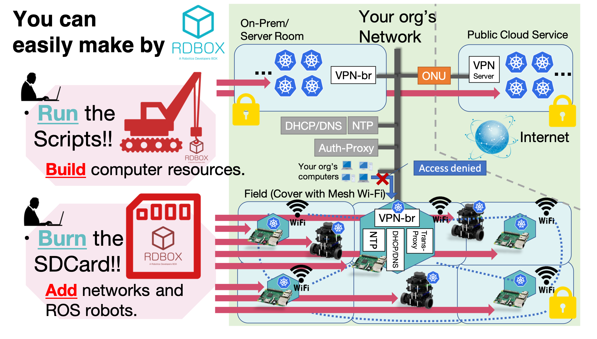
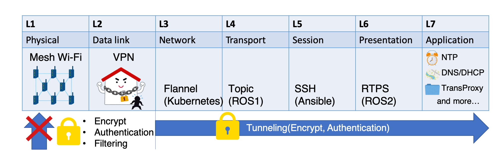
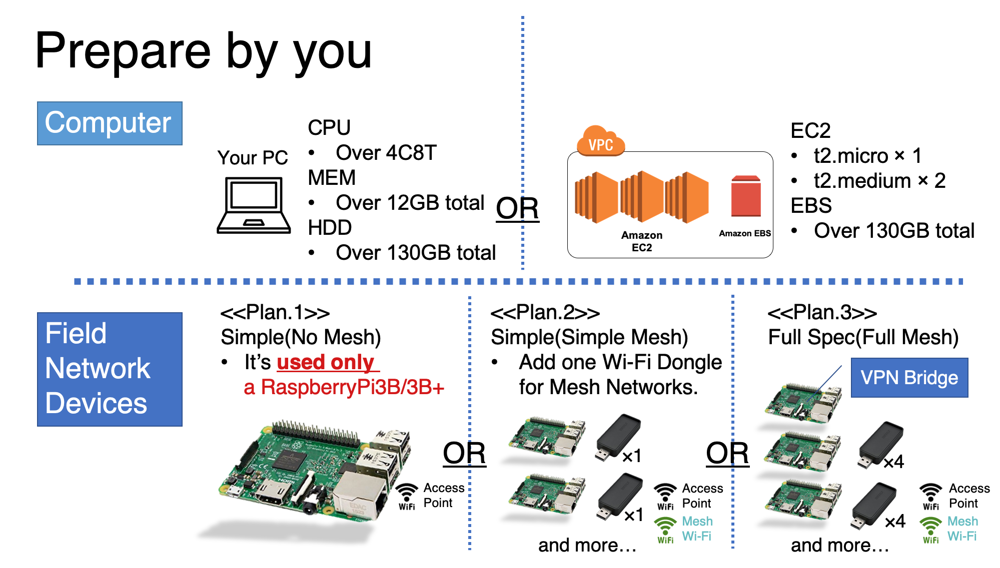
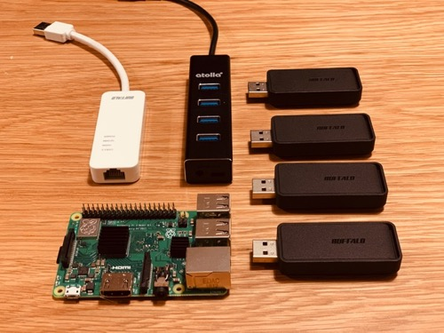
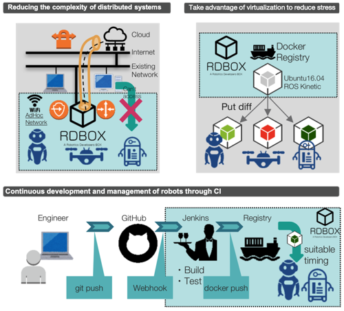

# RDBOX (A Robotics Developers BOX)
[Japanese Page link](https://github.com/rdbox-intec/rdbox/blob/master/README_ja.md)

[](https://github.com/rdbox-intec/rdbox/releases)

RDBOX is a infrastructure for ROS robots. These is very smart like your robot.

<div align="center">
</img>
</div>
<div align="center">
</img>
</div>

It is **built automatically** and **maintained automatically**.
* You can get your only IT infrastructure.
   - **Provides ALL layers (L1 to L7)** of the OSI reference model.
   - **Mesh Wi-Fi network-covered space** by [Raspberry Pi](https://www.raspberrypi.org/)
   - **Strict security**
   - **Compute power provided** by [Kubernetes computer clusters](https://kubernetes.io/)
   - **Deploy and update ROS APPs** by [Kubernetes computer clusters](https://kubernetes.io/)
* Full support for your robot working in on-site.
   - It is easy to separate part of the existing Enterprise network.
      - [SoftEtherVPN\_Stable](https://github.com/SoftEtherVPN/SoftEtherVPN_Stable) 
      - [go\-transproxy](https://github.com/rdbox-intec/go-transproxy)
   - Other Robot Development Platform not enough support on-site.

Get with only **about operations for 2 target.**
* Virtual machine ([VirtualBox](https://www.virtualbox.org/) or [AWS](https://aws.amazon.com/jp/)). 
   - Run the Script!!
* [Raspberry Pi](https://www.raspberrypi.org/).
   - Burn the SDCARD Image!!!


## Getting Started


Please also refer to [the latest release notes.](https://github.com/rdbox-intec/rdbox/releases)

**If you just want to try RDBOX out, check out the [Our Wiki page](../../wiki) to give it a whirl. （英語/日本語の二ヶ国語のマニュアルが用意されています。）**

* Example) [Install VirtualBox](https://github.com/rdbox-intec/rdbox/wiki/setup-rdbox-hq-vb-1-install_tools-en)
   - Continue to [Our Wiki page](https://github.com/rdbox-intec/rdbox/wiki/setup-rdbox-hq-vb-2-prepare_virtual_machine-en)

   ```bash
   $ mkdir ${HOME}/git
   $ cd {HOME}/git
   $ git clone --depth 1 https://github.com/rdbox-intec/rdbox.git
   $ cd ${HOME}/git/rdbox/tutorials/setup-rdbox-hq-vb/conf
   $ cp -p rdbox-hq-vb.params.sample rdbox-hq-vb.params
   $ vi rdbox-hq-vb.params
   $ cd ${HOME}/git/rdbox/tutorials/setup-rdbox-hq-vb/setup-VirtualBox
   $ sudo sh setupVirtualBox.sh
   $ cd ${HOME}/git/rdbox/tutorials/setup-rdbox-hq-vb/setup-vagrant
   $ sudo sh setupVagrant.sh
   ```

* [One of our utilities, flashRDBOX, ](https://github.com/rdbox-intec/flashRDBOX)allows interactive dependency injection (DI) to RaspberryPi. There is no need for difficult operations.
* If you own [TurtleBot3](http://emanual.robotis.com/docs/en/platform/turtlebot3/overview/), you can also experience the deployment of ROS applications.
* Otherwise, you can learn the procedure for building development environment with RDBOX.

## Features
Make your job easy with **3 features**.

### **1. Orchestrate all resources** running "ROS robots".
* You will get a simpler and creative development experience than [deploying with traditional roslaunch](http://wiki.ros.org/roslaunch). Furthermore, it becomes easy to control a lot of groups of robots. 
* Orchestrate ROS nodes on robots and conputer resources by [Kubernetes](https://kubernetes.io/).
    - **Allow mixing of x86 and ARM architecture CPU.**
    - k8s master will run on AWS EC2 or VirtualBox on your PC.
* Connect with the robots and others by [Mesh Wi-Fi Network](https://www.open-mesh.org/projects/open-mesh/wiki).
* Connect with the Clouds/On-Premise by [VPN Network](https://github.com/SoftEtherVPN/SoftEtherVPN_Stable).


### **2. Make It yourself!!**
* The RDBOX Edge devices builds with Raspberry Pi 3B/3B+.
* There is no worry that the back port will be installed. (All source code and hardware are disclosed.)
* Raspberry Pi provides you edge computing and Wi-Fi network and environmental sensors and more.
* Provide assembly procedure and original SD card image.



### **3. NETWORK CONNECT**
* Easily set up a dedicated local area network for robots.
    - Simply connect RDBOX in between the internet and your service robot. In one simple step, you can build a local area network and development environment. No knowledge of internet or networking is necessary.
* Many network applications, including NTP, are offered with the product. Automate your network robot management.
* All you need is a power source. Cover the whole movable range of mobile robots with a Wi-Fi network.




## Compared with other robotics platforms.
**3 Advantages** compared to competitor's "robot development platform".
### 1. The RDBOX Provides ALL layers (L1 to L7) of the OSI reference model.
* Competitor's "robot development platform" does not support it. You may need to pay a great deal of money to a specialist for consultation.
   - Providing access points via mesh Wi-Fi. The robot just connects to the access point.
   - It is possible to get security measures such as VPN and firewall andmore..., and convenient functions such as network application. 
### 2. The RDBOX can be made with general equipment.
* You can start using it with the "laptop" and "Raspberry Pi3B / 3B +" you may already have.
### 3. The RDBOX take in the good points of other companies' robot development platforms.
* It can be used by combining "simulator linkage" and "existing API service" that other companies are good at.
   - Object Detection API
   - Reinforcement learning by Gazebo.
   - and more..


## Components

### Our Components
* [flashRDBOX](https://github.com/rdbox-intec/flashRDBOX)
   - RDBOX command tool to write SD image files to SD card.
* [go\-transproxy](https://github.com/rdbox-intec/go-transproxy)
   - Transparent proxy servers for HTTP, HTTPS, DNS and TCP.
* [rdbox\-middleware](https://github.com/rdbox-intec/rdbox-middleware)
   - Middleware for RDBOX
* [image\-builder\-rpi](https://github.com/rdbox-intec/image-builder-rpi)
   - SD card image for Raspberry Pi with Docker: HypriotOS

### Third Components
* [hostapd](https://salsa.debian.org/debian/wpa)
   - hostapd is an IEEE 802.11 AP and IEEE 802.1X/WPA/WPA2/EAP/RADIUS Authenticator.
   - We are applying and applying [our patch.](https://github.com/rdbox-intec/softether-patches)
* [SoftEtherVPN\_Stable](https://github.com/SoftEtherVPN/SoftEtherVPN_Stable) 
   - Open Cross-platform Multi-protocol VPN Software.
   - We are applying and applying [our patch.](https://github.com/rdbox-intec/wpa-patches)
- [bridge\-utils](https://git.kernel.org/pub/scm/linux/kernel/git/shemminger/bridge-utils.git/)
   - Utilities for configuring the Linux Ethernet bridge.
- [dnsmasq](http://www.thekelleys.org.uk/dnsmasq/doc.html)
   - network services for small networks.
- [nfs](http://nfs.sourceforge.net/)
   - support for NFS kernel server.
- etc.....


## Licence
Licensed under the [MIT](/LICENSE) license.

## Contributing
The following is a set of guidelines for contributing to RDBOX. 

These are mostly guidelines, not rules. 

Use your best judgment, and feel free to propose changes to this document in a pull request.

* Contributions to our components that make up RDBOX apply similar rules.
   - [flashRDBOX](https://github.com/rdbox-intec/flashRDBOX)
   - [go\-transproxy](https://github.com/rdbox-intec/go-transproxy)
   - [rdbox\-middleware](https://github.com/rdbox-intec/rdbox-middleware)
   - [image\-builder\-rpi](https://github.com/rdbox-intec/image-builder-rpi)

1. Fork this repository.
2. Create a branch from `master` branch.
3. Write code.
4. Send a PR from the branch.

## Support & Contacts
For help and feedback, please feel free to contact us.

E-mail consultant is also available.

RDBOX Project (info-rdbox@intec.co.jp)

**If you are favorite to RDBOX, please follow my GitHub account.**
